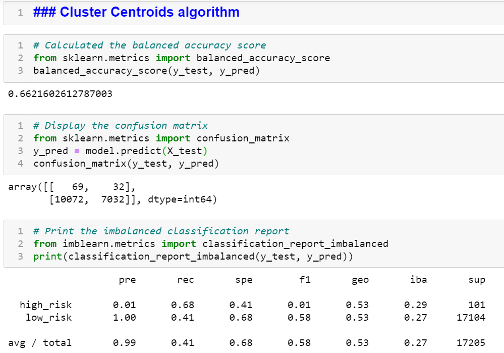

# Credit_Risk_Analysis

## Overview of the analysis

We were tasked to apply machine learning to solve the credit card risk which is real world challenge.

We are using, in this project, imbalanced-learn and scikit-learn libraries to build and evaluate models using resampling.

The card credit dataset is coming from LendingClub, a peer-to-peer lending services company. The following model will be used and related objectives.

1. RandomOverSampler.
2. SMOTE algorithms to oversample the data.
3. ClusterCentroids algorithm (CC) to undersample the data.
4. SMOTEENN algorithm, a combinatorial approach of over- and undersampling.
5. BalancedRandomForestClassifier.
6. EasyEnsembleClassifier. The two models will be compared to reduce bias,  and to predict credit risk.

## Results

Describe the balanced accuracy scores and the precision and recall scores of all six machine learning models.

NAIVE RANDOM OVERSAMPLING (NRO ML)
The NRO ML displayed the following results.

- The balance accuracy is higher in picking up positives low risk credit card however lower with 64% accuracy in the outcome of high-risk credit card outcome we are looking at;
- confusion matrix. The combined classes average values do not give much more confidence in the model. the model failed to predict a large chunk of classes (6319) and 35 classes wrongly classified as high risk.
- The NRO model is perfect in picking up all true negatives (low risk) with a 99% precision rate. For instance, it has retrieved, with a score of 1, all relevant low risk credit card while high risk was below 0.01. However, the model failed to retrieve all relevant data with a recall score of 65% & 63% for both high risk and low risk credit card respectively.

SMOTE

- The balance accuracy is higher in picking up positives low risk credit card however lower with 66% accuracy in the outcome of high-risk credit card outcome we are looking at;
- Confusion matrix. The combined classes average values do not give much more confidence in the model. The model has an improved rate of reducing error with false negative (5291) compared to NRO.
- No significant difference with the NRO model in terms of classification outcomes. The SMOTE model is also perfect in picking up true negatives with a 99% precision rate. For instance, it has retrieved, with a score of 1, all relevant low risk credit card while high risk was below 0.01. However, the model failed to retrieve all relevant data with a recall score of 63% & 69% for both high risk and low risk credit card respectively.

CLUSTERING CENTEROID (CC)

- The balance accuracy is same as the SMOTE model at 66% however effective on the outcome of the model.
- Confusion matrix. The CC model is inefective in eliminating false negative compared to the two previous models. With values above 10002, the error rate is not sustainable.
- No significant difference with the NRO model in terms of classification outcomes. The CC model is also perfect in picking up true negatives with a 99% precision rate. For instance, it has retrieved, with a score of 1, all relevant low risk credit card while high risk was below 0.01. However, the CC model has the most promising recall score percentage with 68% of total data retrieved compared to three models above.

SMOTEEN

- The balance accuracy is lower, 54%, compared to other models so far highlighted.
- Confusion matrix. There is no significant difference with the three other models.
- Classification report. Major difference is on the retrieval of classes with a recall score of 72%, the highest thus far. Retrieval of high-risk credit card is becoming successful with the SMOTEEN model.

BALANCED RANDOM FOREST CLASSIFIER (BRFC)

- The balance accuracy. The BRFC model seems interesting. The accuracy is the highest, 80%, compared to other models so far highlighted.
- Confusion matrix. Significant improvement with reduction for margin of errors. For example, false negative (non-high risk credit cards) plunged to 2086, which is far better for the model accuracy;
- Classification report. Positive trend with an increase of precision up to 0.03 and a recall score of 88%, overall. Meaning that combined classes values/ population , is being retrieved at a higher rate to provide the necessary data to the model.
  
EASY ENSEMBLE CLASSIFIER (EEC)

- Balance accuracy. The EEC accuracy is at 93%, so fa, the most improved model compared to the five others;
- Confusion matrix. False negative plummeted further (944), to provide room for proper prediction as we shall see in the recall score.
- Classification report. Precision surge to 0.09 with a total recall score of 94%, largely balanced and encouraging for the model.

## Summary

We do recommend the EasyEnsembleClassifier Machine Learning Model (EEC). The rationale as you notice in the summary, is that it has the highest precision for high risk credit card default and a recall score above 90%. Based on its confusion matrix, with the significant decrease of false negative (non-high risk) and false positive(non-low risk), the model seems resilient.

The recommendation would be to continue training and testing of the dataset using the EEC model until the precision to track high risk credit card increase to 0.05 and the recall score to improve up to 97% prior production.
